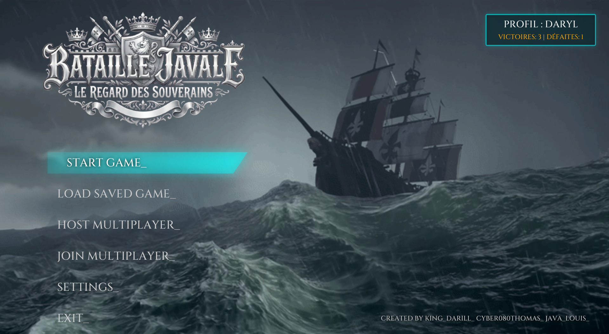
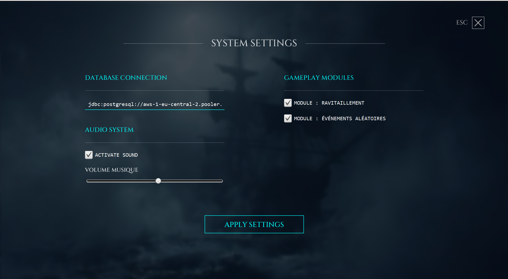
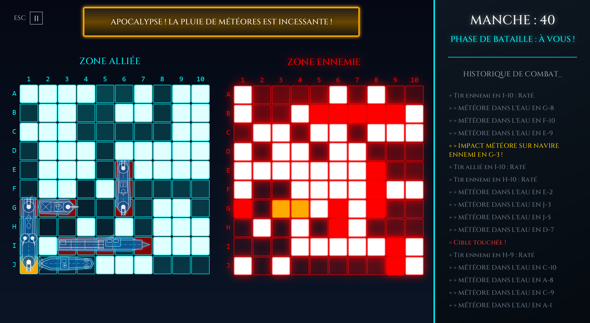

# 🚢 BATAILLE JAVALE : Opération Cyber-Océan 🌊

<p align="center">
  
  
  
  
  
</p>

> **"ESTABLISHING SATELLITE CONNECTIONS... LINK SECURED."** > *Bataille Javale* est une réinvention moderne, dynamique et multijoueur du célèbre jeu de plateau *Touché-Coulé*, développée en Java avec le moteur FXGL. Plongez dans un poste de commandement aux allures de terminal militaire cyberpunk.

---

## 📸 Aperçu du Centre de Commandement

<p align="center">
  
  <br>
  <em>Interface satellite principale : Gestion de profil, Lobbies et Paramètres dynamiques.</em>
</p>

---

## 🚀 Fonctionnalités Principales & Innovation

Nous avons repoussé les limites de la simple grille cliquable pour offrir une véritable expérience vidéoludique :

* **🌐 Multijoueur Cloud-Native :** Système de salons (Lobbies) en temps réel hébergés sur une base PostgreSQL (Supabase). Invitez un adversaire via un ID de session sécurisé.
* **💾 Sauvegarde & Reprise Persistante :** Sauvegarde complète de l'état du plateau, des statistiques globales du profil (Victoires/Défaites) et des préférences (son, interface).
* **🎙️ Moteur Audio Superposé (Custom) :** Un gestionnaire audio complet (`GestionnaireAudio.java`) capable de lire des ambiances en boucle (océan, orage) tout en superposant dynamiquement des effets sonores (SFX) lors des impacts spatiaux.
* **🎨 UI/UX "Terminal Sci-Fi" :** Interface graphique 100% personnalisée codée en Java pur. Utilisation avancée des `DropShadow`, `FadeTransition`, et `ColorAdjust` pour simuler des écrans radars, des brouillages et des néons.
* **🤖 Intelligence Artificielle (Solo) :** Mode entraînement contre un CPU avec algorithme de traque intégré.
* **⚙️ Modules de Gameplay Aléatoires :**
    * *Événements Météorologiques :* Des pluies de météores peuvent frapper la zone, endommageant alliés comme ennemis.
    * *Ravitaillement Stratégique :* (En développement) Récupération de bonus tactiques.

---

## 📋 Architecture & Respect du Cahier des Charges

<details>
<summary><strong>👉 Cliquez pour explorer les détails techniques de notre implémentation</strong></summary>
<br>

Ce projet académique a été conçu avec une rigueur professionnelle, répondant aux critères d'excellence algorithmique et architecturale :

1.  **Architecture MVC & Modulaire :** Séparation stricte entre la logique métier (`core/model`), les interfaces graphiques (`ui`), et les contrôleurs de flux (`controller`).
2.  **Design Patterns Déployés :**
    * *Singleton :* Utilisé pour le `GestionnaireAudio` et le `PreferencesManager` afin de garantir une instance unique accessible globalement.
    * *Repository Pattern :* Création de `PartieRepository` et `JoueurRepository` pour abstraire et sécuriser les requêtes SQL vers la base distante.
    * *Observer / Listener :* Mise en place de `GrilleListener` pour gérer proprement les interactions de glisser-déposer (Drag & Drop) sans coupler la vue et le modèle.
3.  **Gestion Complexe des Données :** Implémentation d'un système de conversion/sérialisation pour stocker l'état complet d'une grille 2D dans le cloud et la reconstruire fidèlement lors du chargement.
4.  **Mécaniques de Jeu Robustes :** Placement dynamique avec vérification des collisions, gestion des rotations, système de tours par états (Attente, Tir, Fin de manche).

</details>

---

## 🛠️ Installation et Déploiement

### Prérequis Système
* **Java Development Kit (JDK) 25** (Recommandé pour FXGL 17+).
* **Maven** (pour la gestion des dépendances : FXGL, Pilotes PostgreSQL).
* Connexion internet active (indispensable pour les accès Cloud).

### Démarrage Rapide

1. **Cloner le dépôt localement :**
   ```bash
   git clone https://github.com/tlombardot/battle-javal.git
Compiler le projet via Maven :

Bash
mvn clean install
Lancer le Centre de Commandement :
Exécutez la classe principale du jeu située dans :
school.coda...ui.DisplayGame.java (ou via la commande Maven exec).

📡 Guide Stratégique : Protocole Multijoueur
Le système multijoueur contourne les limitations locales (LAN) grâce à notre architecture Cloud.

<details>
<summary><strong>Créer une Opération (Hôte)</strong></summary>

Depuis le menu, initialisez le mode HOST MULTIPLAYER_.

Sélectionnez les modules d'anomalies (Événements aléatoires).

Le système validera la liaison satellite et générera un ID DE SALON unique.

Transmettez cet ID (ex: 1042) à votre allié/adversaire.

Une fois connecté, le déploiement de la flotte commence.

</details>

<details>
<summary><strong>Rejoindre une Opération (Invité)</strong></summary>

Accédez à JOIN MULTIPLAYER_.

Sur l'invite SATELLITE LINK, entrez l'ID DE SALON cible.

En cas de ping réussi, la synchronisation du plateau s'effectuera en quelques secondes.

</details>

<p align="center">




<em>Phase de bataille : Radar ennemi (gauche) et Flotte alliée (droite).</em>
</p>

💡 Astuces de Commandants
Calibrage Audio : Jouez-vous sur Discord ? Accédez aux SETTINGS_ pour baisser la musique tout en conservant les SFX d'impact au maximum. Les volumes s'ajustent en temps réel !

Anticipation Météorologique : Si les modules d'événements sont actifs, espacez vos cuirassés. Une pluie de météores ciblée sur un cluster de navires peut détruire la moitié de votre flotte d'un coup.

Le Brouillage Radar : Ne paniquez pas si votre écran devient flou et glitché (BoxBlur). C'est simplement que ce n'est pas votre tour de tirer !

🧠 Retours d'Expérience (Feedbacks & Défis)
Construire Bataille Javale a été un immense défi technique :

Contraintes Audio de JavaFX : Gérer plusieurs flux audio simultanés sans latence a nécessité de créer une classe mémoire (MediaPlayer pour la boucle, AudioClip pour les tirs) pour contourner les blocages de l'API standard.

Asynchronisme et Base de Données : Connecter une interface graphique (Thread UI) à une base distante (PostgreSQL) menaçait de figer le jeu. Nous avons dû gérer des écrans de chargement animés (Establishing Connections) pendant la résolution des requêtes réseau.

Design "Full-Code" : Ne pas utiliser de CSS externe mais tout coder via l'API JavaFX (Gradients, Ombres, Flous) nous a donné un contrôle total sur l'esthétique Cyberpunk, rendant les animations (FadeTransition) beaucoup plus nerveuses.

👨‍💻 Escouade de Développement
Opération menée à bien par :

👑 KING_DARILL_ (Darill) - Dev / Architecture

🤖 CYBER080THOMAS_ (Thomas) - Dev / Data / UI

☕ JAVA_LOUIS_ (Louis) - Dev / Logique Métier

Projet de validation académique réalisé pour [Coda].
